# ConduitAI

**Live demo:** [conduit-ai-eosin.vercel.app](https://conduit-ai-eosin.vercel.app) (frontend) · [conduitai-api.onrender.com/docs](https://conduitai-api.onrender.com/docs) (API). Free-tier hosting (Render) sleeps after 15 min idle — the first request after a while may take ~30-60s to wake up.

Customer data onboarding is where every B2B integration project actually dies: a new customer's CRM/billing/support export never matches your schema, someone hand-maps it once in a spreadsheet, and six months later nobody remembers why `cust_id` became `natural_key` or what happens when the customer adds a field. ConduitAI is a working, end-to-end onboarding pipeline built to answer the question a Forward-Deployed Engineer actually gets paid to answer: **how do you turn "the customer's data doesn't look like your schema" into a repeatable, auditable, non-scary process** — instead of a one-off script nobody trusts a second time.

Upload a messy CSV (or pull one live from a source system's API) and it gets profiled, its columns get proposed against a canonical schema — deterministic signals first, an LLM only for the genuinely ambiguous leftovers — a human reviews and confirms the mapping, and only then does a deterministic, fully-tested transform engine load it. Every mapping is a versioned, diffable JSON document. Every rejected row is visible, explained, and fixable, never silently dropped. Every load is idempotent, so retrying is always safe.

**The one principle that runs through every design decision here: the LLM proposes, the deterministic engine executes.** A model call only ever produces a *reviewable suggestion* — which canonical field a column probably maps to. It never runs in the data hot path, never invents a transform, and every mapping it's involved in is versioned, human-confirmable, and fully reproducible without calling it again. Read [`docs/PROGRESS.md`](docs/PROGRESS.md) for the day-by-day build log — including the bugs, the wrong turns, and the two benchmarks that prove this design earns its keep rather than just sounding good.

## Architecture

```mermaid
flowchart LR
    subgraph Sources["Ingestion"]
        Upload["File upload"]
        API["Mock CRM API\n(paginated, retried)"]
    end

    Upload --> Raw[("Raw records\nimmutable JSONB")]
    API --> Raw

    Raw --> Profile["Profiler\nPolars stats + ydata-profiling"]
    Profile --> Score["Deterministic scorer\nrapidfuzz + fastembed + type signal"]
    Score -- "confident" --> Spec
    Score -- "ambiguous only" --> LLM["LLM tie-break\nGroq → Ollama → fallback"]
    LLM --> Spec[("Mapping spec\nversioned, draft")]

    Spec --> Review{"Human review\n(Next.js UI)"}
    Review -- "override" --> Spec
    Review -- "confirm" --> Confirmed[("Confirmed spec")]

    Confirmed --> Transform["Deterministic transform\n+ Pandera + business rules"]
    Transform -- "valid" --> Canonical[("Canonical tables\ncustomers / invoices / tickets / accounts")]
    Transform -- "invalid" --> Queue["Exception queue\nerror code + explanation + suggested fix"]
    Queue -- "fix / bulk-fix by error code" --> Transform

    Canonical --> Dedupe["Splink fuzzy dedupe\n(same customer, different spelling)"]
    Dedupe -- "merge" --> Canonical
    Canonical --> Metrics["Metrics dashboard"]
```



Every arrow in that diagram is a real, tested code path, not aspirational — see [`docs/PROGRESS.md`](docs/PROGRESS.md) for which day built which box, and the exact bugs found running each one for real.

## Quickstart

```bash
git clone https://github.com/ritigya03/ConduitAI.git && cd ConduitAI
cp backend/.env.example backend/.env   # add your GROQ_API_KEY (free, no card — console.groq.com)
docker compose up --build
```

- API: http://localhost:8000/docs (FastAPI's interactive OpenAPI UI)
- Frontend: `cd frontend && npm install && npm run dev` → http://localhost:3000
- Mock CRM (the "connect API" ingestion source): http://localhost:8100/health

Seed a realistic messy dataset (with a known, labeled ground truth) and run the mapping-accuracy benchmark:

```bash
cd backend
uv run python -m seed.eval_mapping
```

## Canonical schema

```
sources(id, tenant_id, name, kind)                              -- crm | billing | support
onboarding_batches(id, tenant_id, source_id, mapping_spec_version, ...)
mapping_specs(id, tenant_id, source_id, version, spec_json, status, parent_version)
quarantine(id, tenant_id, batch_id, raw_record_json, error_codes[], severity, explanation, suggested_fix, status)
customer_duplicate_candidates(id, tenant_id, customer_id_a, customer_id_b, match_probability, status)
idempotency_keys(id, tenant_id, endpoint, key, request_fingerprint, status_code, response_json)

customers(id, tenant_id, natural_key, legal_name, display_name, email, phone,
          country, industry, risk_tier, vat_number, kyc_status, ..., content_hash, source_batch_id)
accounts(id, tenant_id, customer_id, account_number, status, opened_at)
invoices(id, tenant_id, customer_id, account_id, invoice_number,
         amount_minor_units, currency, issue_date, due_date, status, content_hash, source_batch_id)
support_tickets(id, tenant_id, customer_id, ticket_ref, subject, priority, status, opened_at, closed_at)
```

Money is always an integer count of the currency's minor units (`amount_minor_units` + `currency`), never a float. `natural_key` + `content_hash` on every canonical table is what makes every load idempotent: `INSERT ... ON CONFLICT (tenant_id, natural_key) DO UPDATE ... WHERE content_hash <> excluded.content_hash` — an unchanged row is a no-op, a retried load never creates a duplicate.

## Mapping accuracy: the AI layer earns its cost, quantified

Every project claims its AI layer "works." This one measures it against two benchmarks — a fast in-distribution regression guard, and a held-out one built from real Salesforce/HubSpot/QuickBooks/Zendesk column names never consulted while writing the alias lists — comparing a pure fuzzy-string baseline against the hybrid (rapidfuzz + local embeddings + type signal) scorer, with and without the LLM tie-break:

| Benchmark | Pass | acc@1 | acc@3 | Precision |
|---|---|---|---|---|
| In-distribution (42 cols) | baseline (fuzzy only) | 97.62% | 100.00% | 85.42% |
| In-distribution (42 cols) | hybrid (+ embeddings) | 97.62% | 100.00% | 91.11% |
| **Held-out** (24 cols, never-seen source systems) | baseline (fuzzy only) | 79.17% | 100.00% | 63.33% |
| **Held-out** (24 cols, never-seen source systems) | hybrid (no LLM) | 75.00% | 95.83% | 72.00% |
| **Held-out** (24 cols, never-seen source systems) | **full (+ LLM tie-break)** | **83.33%** | — | — |

The honest story is in the held-out row: the hybrid scorer alone actually *dips below* the fuzzy baseline on data it's never seen (embeddings introduce some noisy picks), and it's specifically the LLM tie-break — called for only the handful of genuinely ambiguous columns, never the whole file — that recovers past both. In-distribution numbers alone would have overstated the case: the seed generator's own column names and the canonical registry's aliases were written by the same hand, so scoring well there partly just proves the alias dictionary matches itself. Reproduce both with `uv run python -m seed.eval_mapping`.

**Live pipeline timing** (upload → profile → propose mapping → confirm → load, 31-row file, warm process): **~2.6s total**, almost entirely the profiling stage (`ydata-profiling`'s HTML report generation); the deterministic transform/validate/load stage is sub-200ms.

## Review UI

*(A GIF of the mapping-review grid — confidence badges, per-column override, the exception queue's bulk-fix bar — belongs here; see the demo video script in [`docs/DEMO_SCRIPT.md`](docs/DEMO_SCRIPT.md) for the exact walkthrough it's captured from.)*

## Production considerations

This is a portfolio build, not a production deployment, and it's honest about the difference: **[`docs/PRODUCTION.md`](docs/PRODUCTION.md)** covers what actually changes moving this to a real VPC — network topology (private subnets, no public DB IP, bastion/VPN access), PII classification and handling (why only column names/samples, never full datasets, ever leave the boundary), and what breaks at real scale (a durable workflow engine instead of synchronous HTTP calls, streaming ingestion for large files, multi-team data governance).

## Engineering notes worth knowing about

**A one-line regex fix moved fuzzy-match accuracy from 73.81% → 90.48%.** The camelCase-splitter meant to turn `CustID` into `Cust ID` was instead putting a space before *every* uppercase letter, so an ALL-CAPS legacy header like `PHONE` was silently getting mangled into `p h o n e` (five fake one-letter words) before it ever reached the matcher. Caught by writing the Day 3 benchmark and asking why a supposedly-easy column was scoring badly.

**A "correct" fix that was actually too broad, caught by the benchmark it was feeding.** The scorer's candidate pool for `billing`/`support` sources was missing the `accounts` table entirely, so `account_number` could never be matched. The first fix — add the whole `accounts` table to those pools — technically worked, but also pulled in `account_status`/`account_opened_at`, which collide with `support_tickets`' near-identical `status`/`opened_at` fields and broke mappings that used to be correct. The benchmark script's own accuracy numbers flagged the regression before it shipped; the real fix added only the one field that was actually missing (`account_number`), not the whole table.

**The first benchmark was leaking, and the fix is a second, held-out one.** The seed generator's legacy column names (`CustID`, `COMPNAME`, `CNTRY`, ...) and the canonical registry's alias lists were written by the same hand, at the same time — the aliases quietly include the exact same abbreviations. 97.62% accuracy on that benchmark proves the alias dictionary matches itself, not that the AI layer earns its cost. Held-out benchmark added specifically to test the honest question instead.

**Why the LLM never proposes transform functions.** Each canonical field's transform (`parse_date`, `to_minor_units`, `trim`, ...) is assigned deterministically from its declared type, not by the LLM. Field types are a small, fixed, fully-enumerable set — a lookup table is simpler, free, and 100% testable. Reach for a model only where the space of answers can't be enumerated in advance.

**A new required field breaks nothing retroactively — verified live, not just asserted.** Adding `customers.kyc_status` as required mid-project (Day 6's "pivot" rehearsal) surfaced a real bug rather than confirming a clean design on paper: `app.record_builder` already scoped its required-field check to whatever a given mapping spec actually maps, but `app.validation.validate_schema` independently re-checked *every* registered field for a table regardless of the spec — so every batch loaded under an older spec broke the instant the new field became required, which is exactly the retroactive breakage the whole exercise is supposed to prove doesn't happen. Fixed by scoping schema validation to the same set of fields the spec actually produced. Full write-up in [`docs/PROGRESS.md`](docs/PROGRESS.md)'s Day 6 section.

**Fuzzy dedupe runs on hand-specified probabilities, not trained ones — deliberately.** Splink's usual workflow statistically estimates match/non-match probabilities via expectation-maximization, but that needs real data volume to converge; on this project's per-tenant customer counts (tens to low hundreds) EM left several comparisons "not trained" and produced zero predictions on an obvious match during a live prototype run. Expert-specified priors (`email` exact match carries the most weight — the same email is strong evidence of the same customer no matter how differently the name is spelled) is a documented, legitimate Splink usage mode, not a shortcut.

**Every mapping spec is `"draft"` until a human confirms it.** `POST /mapping-spec` never marks anything `"confirmed"` on its own — that would let an unreviewed AI-generated spec silently become load-bearing. `POST /mapping-spec/{id}/confirm` is the explicit human-in-the-loop action the review UI calls, and it supersedes whatever was previously confirmed for that source, so at most one confirmed version is ever active.

**Idempotency is two layers, not one.** Content-hash idempotency (`file_hash` on uploads, `natural_key` + `content_hash` on canonical rows) means re-submitting the same data is always safe. Client-supplied `Idempotency-Key` headers (Stripe's pattern) are a separate, complementary layer for the case where the *request itself* gets retried — a client that times out not knowing if the first attempt succeeded — and it's what stops a retried `POST /mapping-spec` from creating a spurious extra draft version, which the plain content-hash approach can't prevent since two identical requests would otherwise each legitimately produce a new version.

## Stack

FastAPI · SQLModel · Postgres 16 · Alembic · Polars · rapidfuzz · fastembed · Instructor · Groq / Ollama · tenacity · Splink (DuckDB backend) · httpx · Docker Compose · Next.js · TypeScript · Tailwind v4 · shadcn/ui · TanStack Table v8
